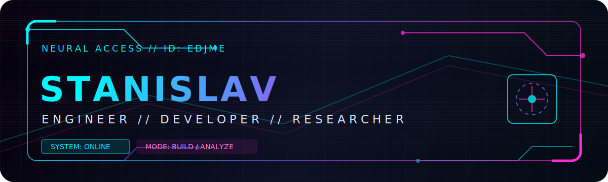
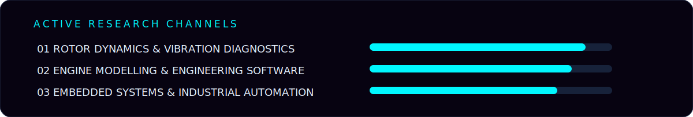

<p align="center">
  
</p>

<p align="center">
  <a href="https://github.com/edjme">
    
  </a>
  
</p>

```text
╔══════════════════════════════════════════════════════════════════════╗
║  ACCESS GRANTED                                                     ║
║                                                                      ║
║  I build systems at the intersection of mechanics, mathematics,     ║
║  diagnostics, embedded control and software engineering.            ║
║                                                                      ║
║  Current mission: turn complex physical processes into measurable,  ║
║  explainable and controllable digital systems.                       ║
╚══════════════════════════════════════════════════════════════════════╝
```

<p align="center">
  
</p>

## `> IDENTITY_MATRIX`

```yaml
name: Stanislav
handle: edjme
class: Engineer / Developer / Researcher
specialization:
  - rotor dynamics
  - vibration diagnostics
  - engine modelling
  - engineering desktop applications
  - embedded systems
  - industrial automation
operating_mode: BUILD → TEST → ANALYZE → IMPROVE
```

<p align="center">
  
</p>

## `> TECHNOLOGY_STACK`

<p align="center">
  
</p>

<p align="center">
  
  
  
  
</p>

## `> FEATURED_SYSTEMS`

<table>
  <tr>
    <td width="50%" valign="top">
      <h3><a href="https://github.com/edjme/engine_design">⚙ engine_design</a></h3>
      <p>Engineering workspace for engine design, calculations and computational experiments.</p>
      <code>MODELLING // MECHANICS // CALCULATION</code>
    </td>
    <td width="50%" valign="top">
      <h3><a href="https://github.com/edjme/engine_dynamics_app">◉ engine_dynamics_app</a></h3>
      <p>Desktop engineering application focused on kinematics, dynamics and visualization.</p>
      <code>C++ // CMAKE // ENGINEERING GUI</code>
    </td>
  </tr>
  <tr>
    <td width="50%" valign="top">
      <h3><a href="https://github.com/edjme/Algoritms">⌬ Algoritms</a></h3>
      <p>Algorithmic practice, data structures and computational problem solving.</p>
      <code>ALGORITHMS // LOGIC // OPTIMIZATION</code>
    </td>
    <td width="50%" valign="top">
      <h3><a href="https://github.com/edjme/tg_bot">▣ tg_bot</a></h3>
      <p>Automation and bot-development experiments for practical workflows.</p>
      <code>AUTOMATION // INTEGRATION // BACKEND</code>
    </td>
  </tr>
</table>

<p align="center">
  
</p>

## `> TELEMETRY`

<p align="center">
  
  
</p>

<p align="center">
  
</p>

## `> OPERATING_PRINCIPLES`

```text
[01] Physics before assumptions.
[02] Measurements before conclusions.
[03] Architecture before implementation.
[04] Reliability before visual polish.
[05] Continuous iteration until the system behaves predictably.
```

<p align="center">
  
</p>

<p align="center">
  <code>STATUS: ONLINE</code>
  &nbsp;•&nbsp;
  <code>CHANNEL: ENGINEERING</code>
  &nbsp;•&nbsp;
  <code>NODE: EDJME</code>
</p>

<p align="center">
  <sub>Designed as a cyberpunk engineering interface.</sub>
</p>
